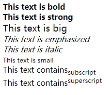

#第一部分 HTML基础教程

##第一章 HTML文本格式化实例

HTMl可定义很多供格式化输出的元素，比如粗体和斜体字。

###1.1 文本格式化

```
<html>
<body>
<b>This text is bold</b>
<br />
<strong>This text is strong</strong>
<br />
<big>This text is big</big>
<br />
<em>This text is emphasized</em>
<br />
<i>This text is italic</i>
<br />
<small>This text is small</small>
<br />
This text contains<sub>subscript</sub>
<br />
This text contains<sup>superscript</sup>
</body>
</html>
```
效果如下：



语义化是 HTML5 最大的特性之一，而所有被 HTML5 保留的标签都带有其特有的语义，它们分别被重新赋予了语义。
* b元素现在描述为在普通文章中仅从文体上突出的不包含任何额外的重要性的一段文本。比如文章摘要中的关键词、评测文单中的产品名称、文章的导言等
* i元素现在描述为在普通文章中突出不同意见或语气或其他的一段文本，例如，多用于生物学名、术语、外来语、一个想法、谚语等
* em元素代表对其内容的强调
* strong元素代表内容的强烈的重要性、严重情或者紧急性，strong元素可以用在标题、说明或者段落上来显示这部分包围的文字的重要性

###1.2 预格式文本
```
<html>
<body>
<pre>
艳色天下重，  西施宁久微。
朝为越溪女，  暮作吴宫妃。
贱日岂殊众，  贵来方悟稀。
邀人傅脂粉，  不自著罗衣。
君宠益娇态，  君怜无是非。
当时浣纱伴，  莫得同车归。
持谢邻家子，  效颦安可希！
</pre
<pre>pre标签很适合显示计算机代码：</p>
<pre>
for i=1 to 10
    print i  
next i
</pre>
</html>
</body>
```
效果如下：


###1.3 “计算机输出”标签
```
<html>
<body>
<code>Computer code</code>
<br />
<kbd>Keyboard input</kbd>
<br />
<tt>Teletype text</tt>
<br />
<samp>Sample text</samp>
<br />
<var>Computer variable</var>
<br />
<p>
<b>注释：</b>这些标签常用于显示计算机/编程代码。
</p>
</body>
</html>
```
效果如下：


* code元素用于定义计算机代码
* kbd元素用于定义键盘码
* samp元素定义代码样本
* tt元素用于定义打字机代码
* var用于定义变量

###1.4 地址
```
<!DOCTYPE html>
<html>
<body>

<address>
Written by <a href="mailto:webmaster@example.com">Donald Duck</a>.<br>
Visit us at:<br>
Example.com<br>
Box 564, Disneyland<br>
USA
</address>

</body>
</html>
```

效果如下：


###1.5 缩写和首字母缩写
```
<html>

<body>

<abbr title="etcetera">etc.</abbr>
<br />
<acronym title="World Wide Web">WWW</acronym>

<p>在某些浏览器中，当您把鼠标移至缩略词语上时，title 可用于展示表达的完整版本。</p>

<p>仅对于 IE 5 中的 acronym 元素有效。</p>

<p>对于 Netscape 6.2 中的 abbr 和 acronym 元素都有效。</p>

</body>
</html>
```
效果如下：


###1.6 文字方向
```
<html>

<body>

<p>
如果您的浏览器支持 bi-directional override (bdo)，下一行会从右向左输出 (rtl)；
</p>

<bdo dir="rtl">
Here is some Hebrew text
</bdo>

</body>
</html>
```
效果如下：


###1.7 块引用
```
<html>

<body>

这是长的引用：
<blockquote>
这是长的引用。这是长的引用。这是长的引用。这是长的引用。这是长的引用。这是长的引用。这是长的引用。这是长的引用。这是长的引用。这是长的引用。这是长的引用。
</blockquote>

这是短的引用：
<q>
这是短的引用。
</q>

<p>
使用 blockquote 元素的话，浏览器会插入换行和外边距，而 q 元素不会有任何特殊的呈现。
</p>

</body>
</html>

```
效果如下：


###1.8 删除字效果和插入字效果
```
<html>

<body>

<p>一打有 <del>二十</del> <ins>十二</ins> 件。</p>

<p>大多数浏览器会改写为删除文本和下划线文本。</p>

<p>一些老式的浏览器会把删除文本和下划线文本显示为普通文本。</p>

</body>
</html>
```
效果如下：


